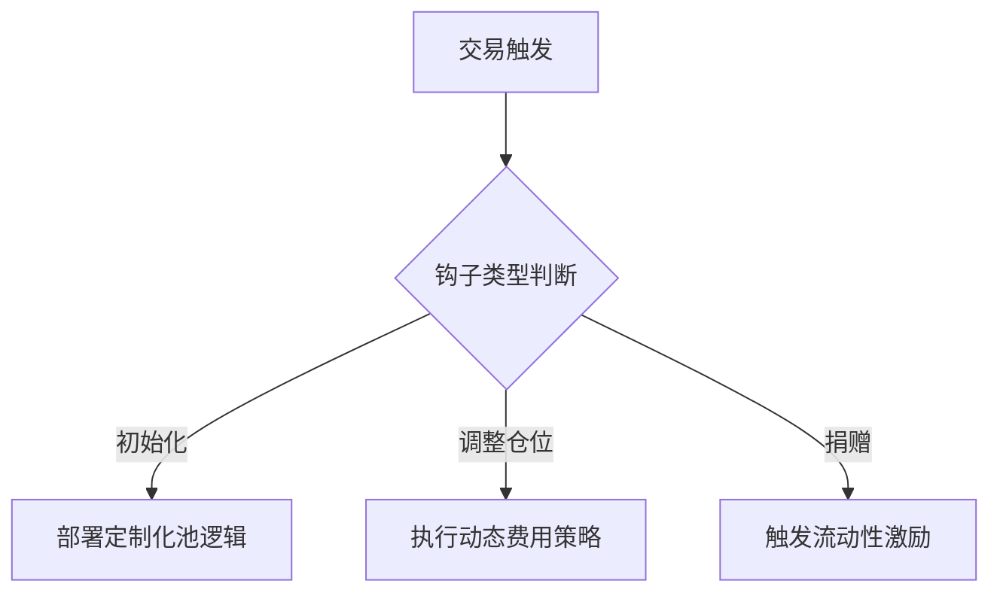

```markdown
# Uniswap V4：提升定制性与表达性的现货去中心化交易所升级

## 单例合约：区块链效率革命

Uniswap V4的核心创新在于采用单例合约架构。相较于V3版本每个流动性池都需要独立合约的低效模式，新架构通过单一合约管理所有流动性池，实现99%的Gas费用降幅。这种设计突破了传统AMM的架构边界，借助以太坊Cancun升级引入的EIP-1153瞬态存储方案，构建了革命性的"闪电记账"系统。

👉 [了解区块链交易成本优化方案](https://bit.ly/okx_welcome)

### 技术革新解析
- **Gas效率提升**：多跳交易Gas消耗降低约60%
- **瞬态存储优势**：TSTORE/TLOAD操作分别仅需100/1000Gas
- **状态爆炸缓解**：节点存储压力减少85%以上

| 指标对比 | Uniswap V3 | Uniswap V4 |
|---------|------------|------------|
| 池部署Gas | 1,200,000  | 12,000     |
| 多跳交易Gas | 300,000    | 120,000    |
| 合约数量   | 池数量×5   | 1          |

## ERC-1155：流动性凭证的范式转移

V4版本采用的ERC-1155标准开创了流动性凭证管理新纪元。这种混合型代币标准结合了ERC-20的同质化特性和ERC-721的非同质化优势，在保持每个LP仓位独特性的同时，实现了批量处理效率提升300%。

### 核心优势矩阵
- **批量转账**：单次交易处理100+流动性仓位
- **智能转账钩子**：实时验证流动性转移合法性
- **合约内资产隔离**：避免V3时代频繁的代币跨合约转移

## 钩子系统：可编程金融基础设施

V4的钩子系统为DeFi创新打开了潘多拉魔盒。通过8类触发事件（初始化、仓位调整、交易、捐赠等），开发者可构建定制化AMM逻辑。这种模块化设计使Uniswap从交易协议进化为可编程流动性平台。

### 关键应用场景
1. **动态费用机制**：基于波动率预言机的弹性费用模型
2. **MEV价值捕获**：通过交易排序优化提升流动性收益
3. **流动性粘性设计**：时间衰减型退出费用机制



## 行业影响与未来展望

### 平台化战略
Uniswap V4通过整合CrocsSwap的单例架构、Trader Joe的动态费用、Balancer的流动性配置等创新，构建了DeFi领域首个可定制化流动性平台。这种"协议即服务"的模式将重塑AMM行业格局。

### 专业流动性时代
数据显示，在V3池中：
- 前8%的地址控制80%流动性
- 专业做市商收益比散户高45%
- JIT流动性占比达交易量的32%

V4的钩子系统将加速这一趋势，催生专业钩子开发者等新职业形态。DEX聚合器需要构建智能路由引擎，以应对多钩子交互的复杂性。

👉 [探索专业做市策略](https://bit.ly/okx_welcome)

## 常见问题解答

### Q1：单例合约如何降低Gas费用？
A：通过EIP-1153瞬态存储实现交易内状态聚合计算，减少重复状态读写。多跳交易Gas消耗降低约60%，池部署成本下降99%。

### Q2：ERC-1155对流动性管理有何改进？
A：支持批量处理提升300%效率，智能转账钩子可阻止非法转移，合约内资产隔离减少跨合约交互。

### Q3：钩子系统如何改善LP收益？
A：通过动态费用、MEV捕获、退出费用设计等机制，可将LP收益提升25-50%，特别是针对套利交易的收益内化。

### Q4：V4对DeFi行业有何影响？
A：推动AMM平台化发展，加速专业流动性服务普及，催生钩子开发者新生态，重塑DEX聚合器路由逻辑。

### Q5：普通用户如何受益？
A：更低的交易滑点、更优的价格发现机制、更丰富的定制化流动性产品，以及通过专业钩子设计获得的额外收益激励。

## 未来演进方向

随着协议自有流动性(POL)与钩子系统的结合，将出现：
- 动态定价的流动性壁障
- 范围流动性激励机制
- 协议控制的流动性保险库

这些创新将推动Uniswap从单纯的价格发现工具，进化为完整的资产定价基础设施。专业做市商与算法工程师的协作将成为DeFi下一阶段发展的关键驱动力。

👉 [把握DeFi创新机遇](https://bit.ly/okx_welcome)
```