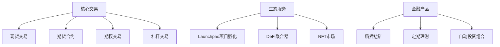

# 最佳加密货币购买应用推荐

## 加密货币入门必读指南

随着数字资产市场的快速发展，越来越多投资者开始关注加密货币交易。本文将为您解析如何选择安全可靠的加密货币购买渠道，并推荐两款全球领先的交易平台。

### 选择加密货币应用的核心标准
在评估加密货币交易平台时，需重点关注以下核心要素：

1. **私钥控制权**  
   专业投资者常说："不是你的私钥，就不是你的数字资产"。选择能提供完整私钥管理的应用，不仅能确保资产安全，还能参与DeFi、NFT等区块链生态应用。

2. **合规性与安全性**  
   优先选择通过ISO 27001认证、持有MSB牌照等国际合规认证的平台，查看其冷热钱包存储比例、历史安全事件记录等关键指标。

3. **地域适配性**  
   不同国家地区的监管政策差异显著，建议优先选择在目标市场运营超过3年、用户规模超千万的成熟平台。

4. **功能完备性**  
   综合考量法币入金通道、支持币种数量、交易手续费、衍生品工具等维度，选择能满足长期投资需求的平台。

👉 [立即体验顶级加密货币平台](https://bit.ly/okx_welcome)

## 推荐应用一：Coinbase

### 平台核心优势
作为全球合规化程度最高的加密货币交易所之一，Coinbase具备以下显著优势：

| 指标                | 数据表现              |
|---------------------|-----------------------|
| 注册用户            | 超7300万              |
| 支持法币            | 100+种                |
| 上线币种            | 200+种                |
| 安全赔付基金        | 2.5亿美元              |
| 交易延迟            | 平均1.2秒             |

### 新手友好型操作流程
1. **三步完成首笔交易**  
   - 绑定银行卡/信用卡完成法币充值
   - 选择目标币种（BTC/ETH等200+币种）
   - 输入金额确认购买（支持0.1美元起投）

2. **特色增值功能**  
   - 学习赚币计划：通过视频教程获取ETH奖励
   - 质押服务：主流币种年化收益达4-8%
   - 借记卡服务：支持全球5000万商户直接消费

3. **全球合规布局**  
   已获得美国、英国、日本等主要市场的金融服务牌照，支持100+国家地区用户交易。

👉 [立即体验顶级加密货币平台](https://bit.ly/okx_welcome)

## 推荐应用二：Binance

### 专业投资者优选平台
币安以丰富的交易品种和创新功能著称，特别适合以下用户群体：
- 需要高频交易的专业投资者
- 关注新兴项目的早期投资者
- 需要衍生品交易工具的用户

### 平台功能矩阵

### 创新功能亮点
- **新币首发优势**：平均比竞争对手早3-5周上线新兴项目
- **交易工具矩阵**：提供网格交易、DCA定投等12种智能交易策略
- **全球化服务**：支持20种语言界面，法币入金通道覆盖180个国家

## 加密投资风险提示

### 市场波动特征
2022-2023年主要加密货币波动数据：
| 币种   | 最大涨幅 | 最大跌幅 | 年化波动率 |
|--------|----------|----------|------------|
| 比特币 | 63%      | -58%     | 42%        |
| 以太坊 | 91%      | -67%     | 55%        |
| 狗狗币 | 850%     | -82%     | 78%        |

### 风险控制建议
1. **仓位管理**：单品种持仓不超过总资产的5%
2. **止盈止损**：设置动态止盈（建议30-50%）和止损区间（建议-20%）
3. **分散投资**：配置主流币（60%）、优质项目（30%）、概念币（10%）
4. **长期持有**：选择市值前10的主流币进行3年以上周期投资

## 常见问题解答

### Q1：如何判断平台是否安全？
A：可核查平台是否通过以下认证：
- ISO 27001信息安全管理体系认证
- CISA网络安全认证
- 银行级SSL加密等级（TLS 1.3以上）
- 是否设有投资者保护基金

### Q2：零基础如何开始投资？
A：建议遵循四步走策略：
1. 学习区块链基础知识（推荐Coursera区块链专项课程）
2. 通过模拟交易熟悉操作
3. 用闲置资金进行小额实盘交易
4. 逐步建立投资组合

### Q3：加密货币收益如何报税？
A：各国税务政策不同，以中国为例：
- 持有超3年免征资本利得税
- 矿工收入按经营所得计税
- 建议使用CoinMarketCap税务工具生成合规报告

### Q4：如何应对市场剧烈波动？
A：专业投资者常用策略：
- 波动率指标(VIX)监测
- 建立对冲头寸（期权/期货）
- 动态调整风险敞口
- 设置自动止盈止损

👉 [立即体验顶级加密货币平台](https://bit.ly/okx_welcome)

## 投资者决策矩阵

| 考核维度   | Coinbase评分 | Binance评分 |
|------------|--------------|-------------|
| 新手友好度 | 9.2/10       | 7.5/10      |
| 交易品种   | 8.0/10       | 9.8/10      |
| 手续费率   | 4.5/10       | 9.0/10      |
| 安全评级   | 9.5/10       | 8.8/10      |
| 客服响应   | 8.7/10       | 7.2/10      |

*数据来源：CryptoCompare 2023年度交易所评测报告*

建议根据自身投资策略选择平台：保守型投资者优选Coinbase，专业交易者可选择Binance。无论选择哪个平台，都建议先通过模拟账户熟悉操作，再进行实质性投资。